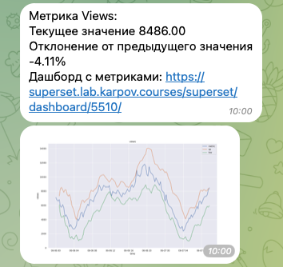
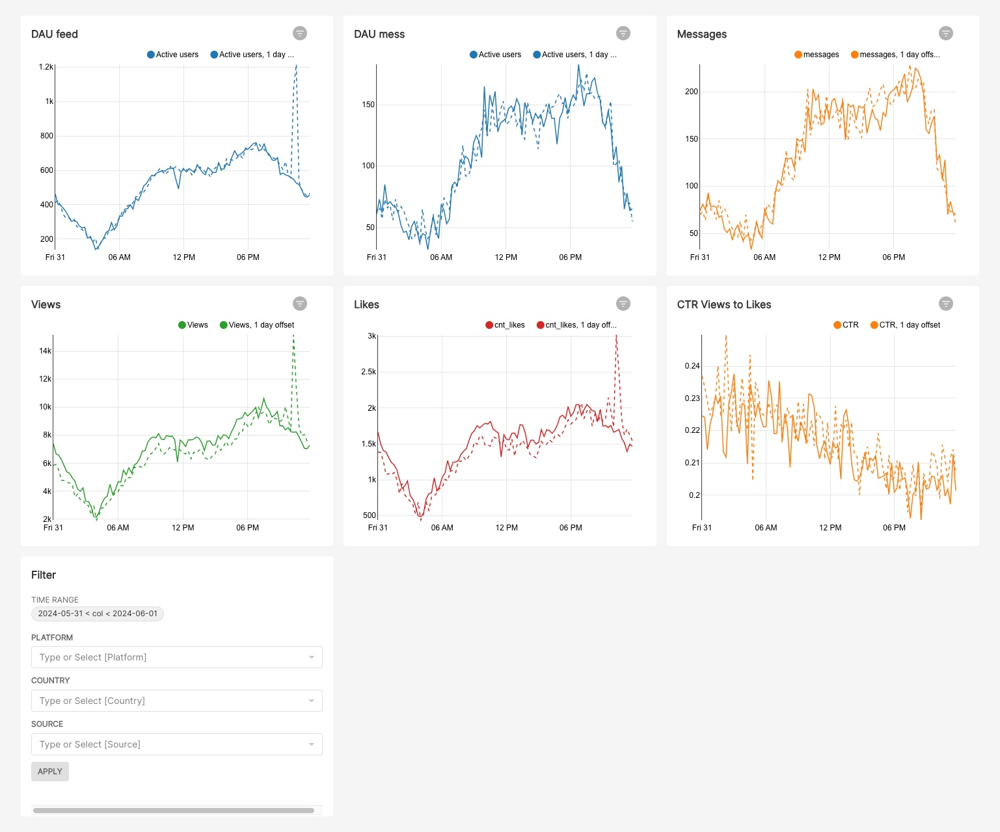

# Поиск аномалий (система алертов)

## Оглавление:

[1. Описание проекта.](#1-описание-проекта) 
[2. Краткая информация о данных.](#2-краткая-информация-о-данных) 
[3. Этапы работы над проектом.](#3-этапы-работы-над-проектом) 
[4. Использованные инструменты и библиотеки.](#4-использованные-инструменты-и-библиотеки) 

### 1. Описание проекта.

**Аномалии** - это необычный характер поведения данных, несвойственные метрике изменения. Причин появления аномалий может быть несколько (технические сбои в работе сервиса, сбои в ETL-процессах, ошибки при обработке данных, глобальные факторы). 

Для бизнеса важно своевременно отслеживать возможные аномалии, чтобы иметь возможность устранить проблему как можно раньше. Если предположить ситуацию, что в работе сервиса наступил сбой поздно вечером, и мы обнаружим проблему только утром - за это время многие клиенты могут покинуть наш сервис и оставить негативный отзыв.

Для постоянного мониторинга можно использовать такие сервисы, как [Apache Airflow](https://airflow.apache.org/), которые позволяют управлять рабочими процессами по заданному расписанию.

Для детектирования аномалий используются различные методы, в зависимости от поставленной задачи - начиная от сравнения со значениями в предыдущий временной период, до использования методов машинного обучения. 

При детектировании в режиме **realtime**, как правило, используются статистические методы. Для рассчетов в данном проекте использовался **межквартильный размах**. Метод хорош тем, что не требует нормального распределения данных. Также дополнительным плюсом будут границы, которые можно разместить на графиках для визуальной оценки величины отклонения.

Идея метода состоит в построении доверительных интервалов, выход за которые будет говорить об аномальном поведении метрики. Границы интервалов вычисляются с помощью квантилей:
$$xi​<q25n​−a∗IQRn​  |  xi​>q75n​+a∗IQRn​$$
- $q25n$ ​− 0.25 персентиль за период n (или же 1 квартиль)
- $q75n$ ​− 0.75 персентиль за период n (или же 3 квартиль)
- $IQRn​=q75n​−q25n$ ​− межквартильный размах за период n
- $a$ − коэффициент, определяющий ширину интервала 

Для метрики CTR используется другой подход: поскольку исторические данные говорят о том, что величина CTR колеблется в диапазоне 0.195 - 0.22, для отслеживания аномалий установлены жесткие границы.

Таким образом, каждые 15 минут проверяются значения основных метрик и сравниваются с установленными границами. Если метрика выходит за границы, телеграм-бот отправляет сообщение в чат. В сообщении указываются: название метрики, значение метрики, отклонение от вчерашнего значения в этот же временной период. Также выводится график поведения метрики в сравнении с границами и предлагается ссылка на дашборд, на котором можно более детально рассмотреть поведение всех контролируемых метрик.
Пример сообщения:

Дашборд:

Так как все метрики, кроме CTR имеют сезонность внутри суток, параметр n не должен быть слишком большим и должен охватывать период, когда метрика ведет себя схожим образом.

Для начала устанавливаем n=5 и a=3, а далее, в тестовом режиме проверяем, требуют ли границы корректировки. При увеличении коэффициентов границы будут расширяться и мы не отловим возможные аномалии, и наоборот, при уменьшении мы получим ложные срабатывания.

После отладки графиков и корректировки параметров, устанавливаем дефолтные параметры для таска и интервал запуска DAG. 

⬆️[К оглавлению](#оглавление)

### 2. Краткая информация о данных.

Данные содержат информацию о ленте новостей и мессенджере и обновляются в режиме реального времени. В ClickHouse находятся две таблицы: по ленте новостей и по мессенджеру. Поля содержат информацию о действиях пользователей (просмотрах и лайках), постах, отправленных и полученных сообщениях, о поле, стране и городе и т.п.

⬆️[К оглавлению](#оглавление)

### 3. Этапы работы над проектом.
1. Построение дашборда.
2. Отладка кода и настройка параметров.
3. Создание DAG и task.
4. Запуск DAGа.
 

⬆️[К оглавлению](#оглавление)

### 4. Использованные инструменты и библиотеки.
* Apache Airflow
* Apache Superset
* ClickHouse
* matplotlib==3.3.2 
* seaborn==0.11.0 
* python-telegram-bot==13.7 
* pandahouse==0.2.7 
* pandas==2.0.2

⬆️[К оглавлению](#оглавление)